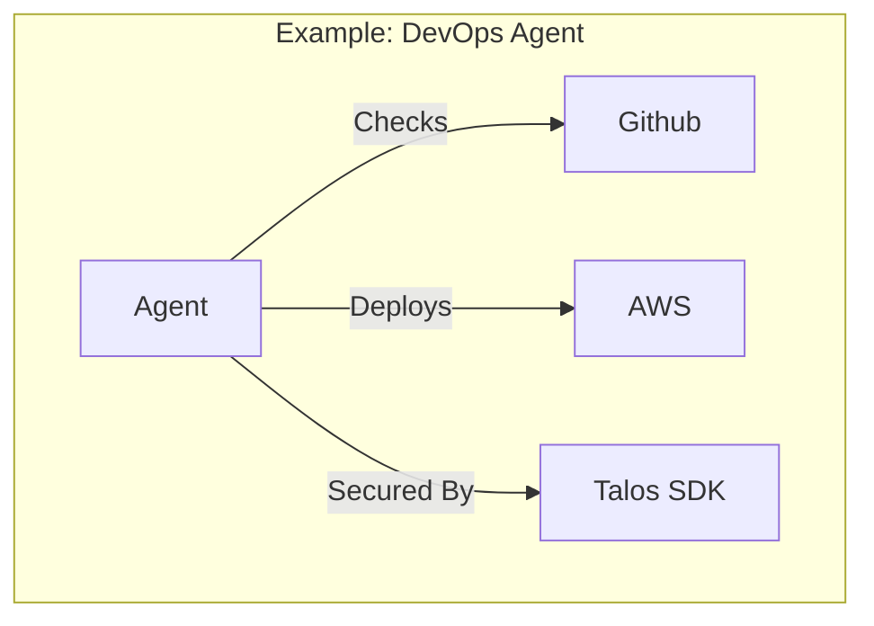

# Talos Examples

**Repo Role**: Canonical example implementations, demos, and reference architectures for Talos.

## Abstract
This repository contains curated examples demonstrating best practices for building secure agents with Talos. It covers common patterns including simple chatbots, multi-agent swarms, and infrastructure automation.

## Introduction
Documentation describes *what* components do; examples show *how* to use them. `talos-examples` provides working, deployable code that developers can clone and modify.

## System Architecture



## Technical Design
### Modules
- **devops-agent**: CI/CD automation agent.
- **multi-agent**: Swarm coordination example.
- **chat**: Simple secure chat application.

## Evaluation
Evaluation: N/A (Education purpose).

## Usage
### Quickstart
```bash
cd devops-agent && ./scripts/demo.sh
```

## Operational Interface
*   `scripts/test.sh`: Validates all examples (docker-config, shebangs).

## Security Considerations
*   **Note**: Examples are for educational purposes. Production deployments require managing your own keys.

## References
1.  [Talos SDK Python](../talos-sdk-py/README.md)
2.  [Talos Docs](../talos-docs/README.md)

## License

Licensed under the Apache License 2.0. See [LICENSE](LICENSE).

Licensed under the Apache License 2.0. See [LICENSE](LICENSE).
