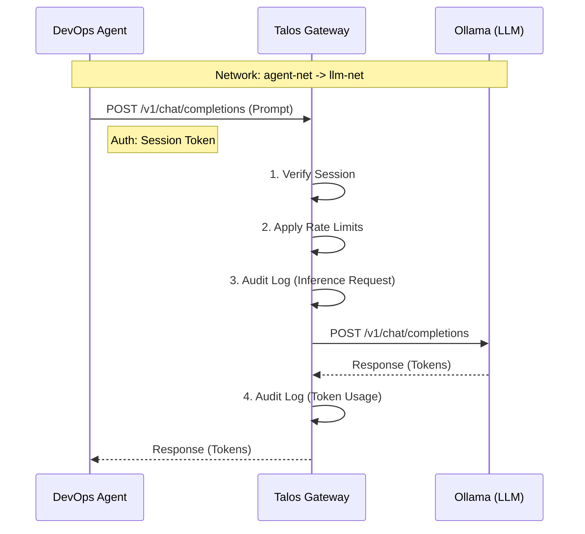
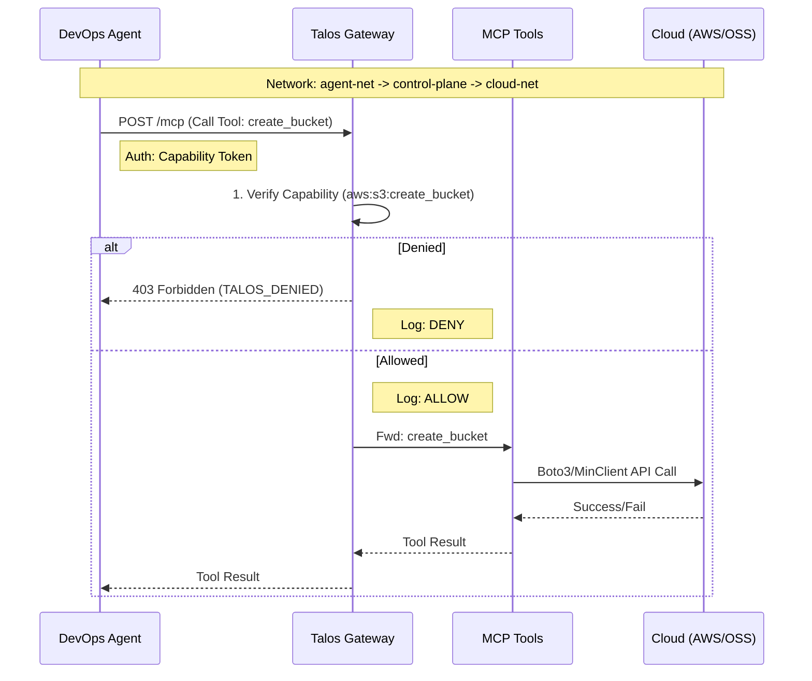

# Request Flows

## 1. Secure Inference Flow (LLM)

The Agent needs to "think". It sends a prompt to the LLM.

## 2. Secure Execution Flow (MCP Tools)

The Agent needs to "act". It calls a tool (e.g., `aws:s3:create_bucket`).

